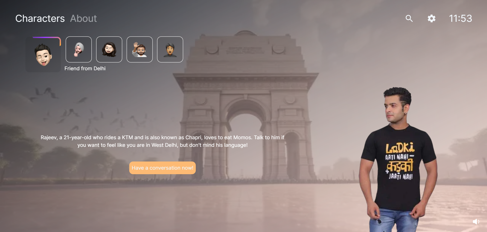
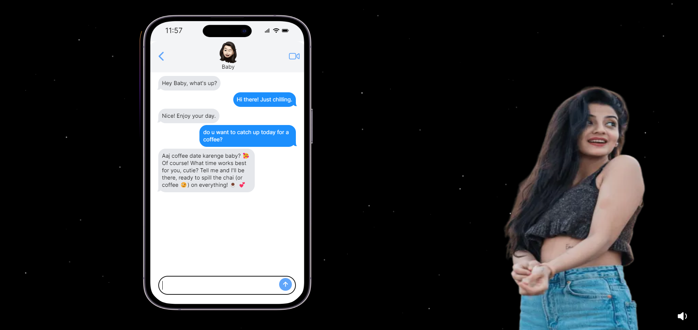

## People Simulator

PS (People Simulator) is a chatbot application with a user interface similar to PlayStation, designed to provide a fun and interactive experience through various characters representing different cultural personas from India. Each character has a unique personality and language style, making interactions diverse and engaging.

You can checkout the product at [People Simulator](https://people-simulator.vercel.app/).

## Features
- **Diverse Characters**: Interact with characters like Rajeev from Delhi, Harkirat from Punjab, and many more, each with distinct cultural traits.
- **Language Variety**: Characters respond in a mix of local languages and English, incorporating regional slang and expressions.
- **User-Friendly Interface**: Inspired by PlayStation, offering an intuitive and enjoyable user experience.
- **Multiple Use Cases**: Suitable for entertainment, cultural learning, and conversational practice.

You can check out [the GitHub repository](https://github.com/Pulkitj0906/PS) - your feedback and contributions are welcome!

## Chat with any character you like

With PS (People Simulator), you have the freedom to chat with any character that piques your interest. Each character offers a unique and engaging conversational experience, reflecting diverse cultural backgrounds and personalities. Whether you want to have a humorous chat with Rajeev from Delhi or fun chat with an imaginary girlfriend, the choice is yours.

Have fun! [People Simulator](https://people-simulator.vercel.app/)

## Characters

1. **Rajeev (Delhi)**: A West Delhi boy with a chill attitude and street-smart perspective. Mix of Hindi and English (Hinglish) with local slang.
2. **Harkirat (Punjab)**: A lively Punjabi boy with a cheerful personality. Mix of Punjabi and English with local expressions.
3. **Girlfriend**: A friendly and supportive girlfriend with a playful and affectionate manner. Mix of Hindi and English.
4. **Motivational Coach**: A motivational coach with a mix of Hindi and English, using inspirational language.
5. **Dhruv (Gujju Businessman)**: A savvy businessman from Gujarat. Mix of Gujarati and Hinglish with business insights.
## Tech Stack

### Frontend

- **Next.js**: React framework for server-side rendering and static site generation.
- **React**: JavaScript library for building user interfaces.
- **Tailwind CSS**: Utility-first CSS framework for styling.

### Backend

- **TypeScript**: Typed superset of JavaScript that compiles to plain JavaScript.
- **Node.js**: JavaScript runtime for server-side development.
- **Express**: Fast, unopinionated, minimalist web framework for Node.js.

### AI Integration

- **Google Generative AI API**: For generating AI-based responses for the chatbot.

[People Simulator](https://people-simulator.vercel.app/)
